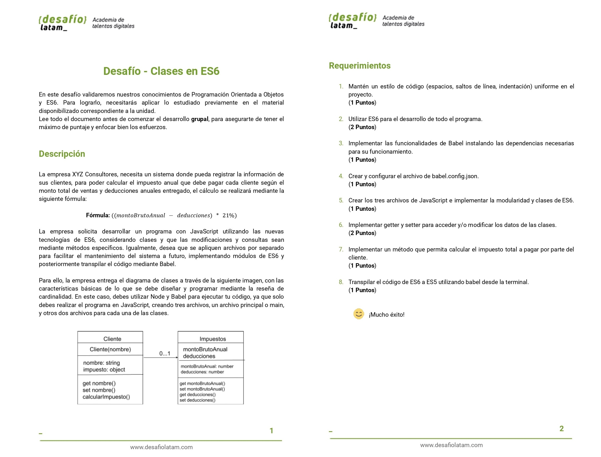
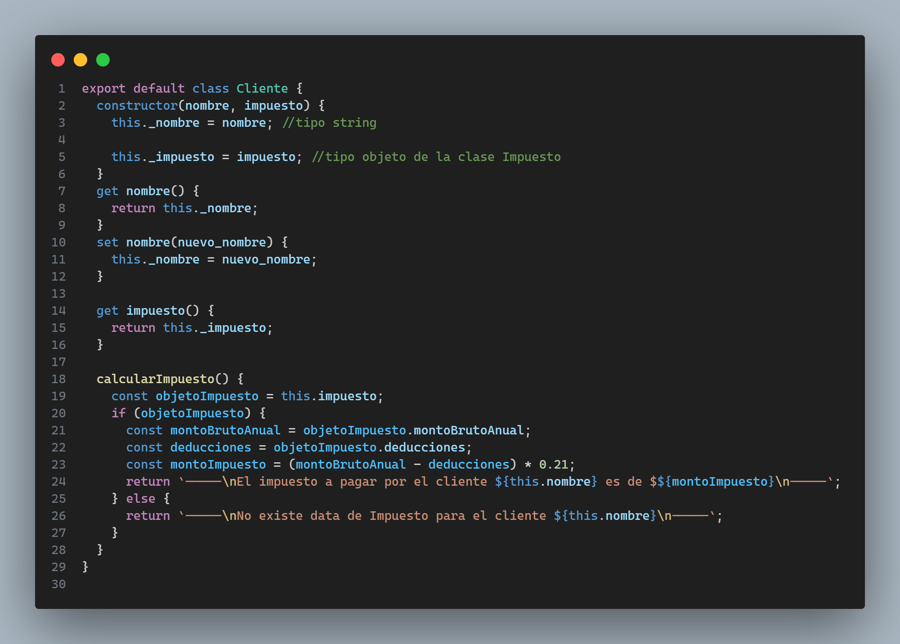
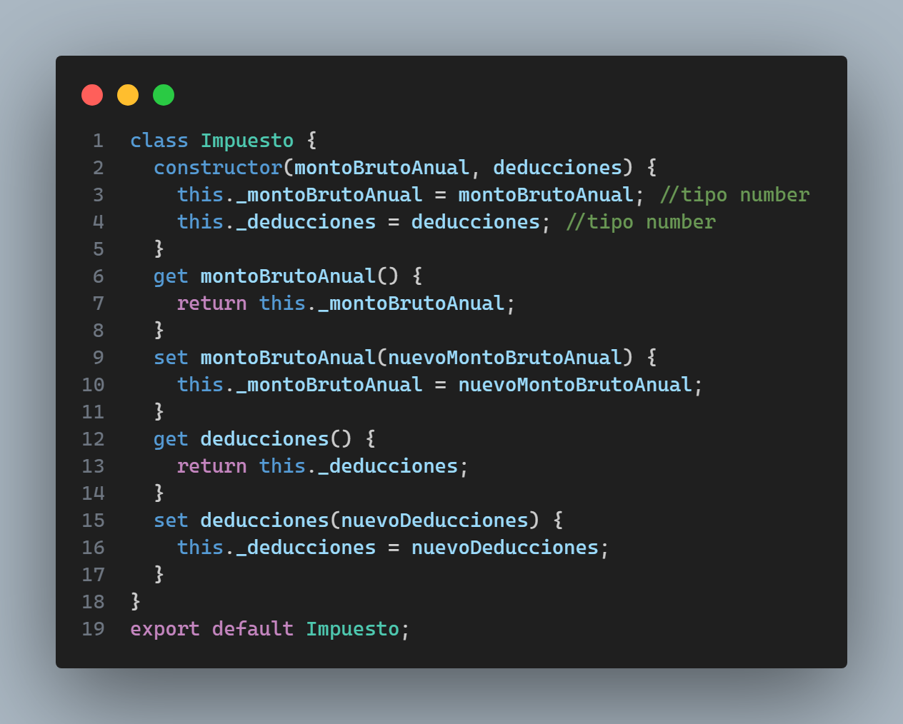
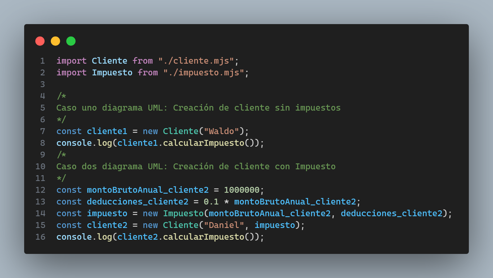
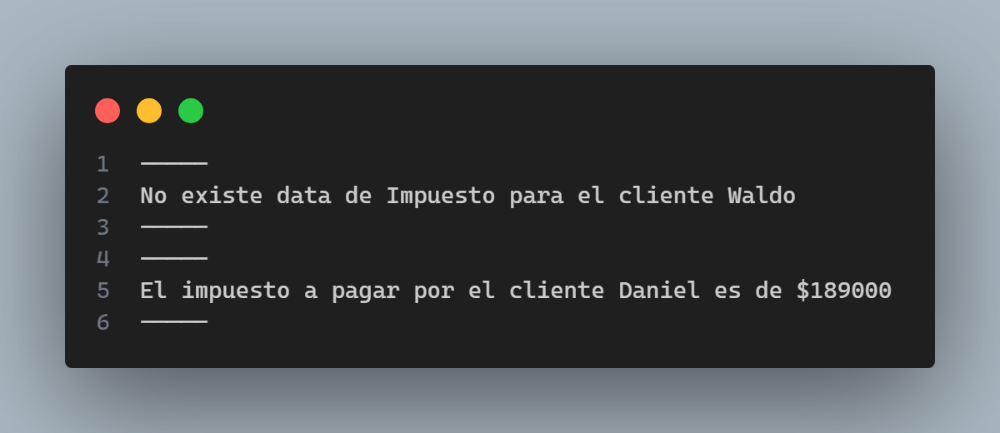
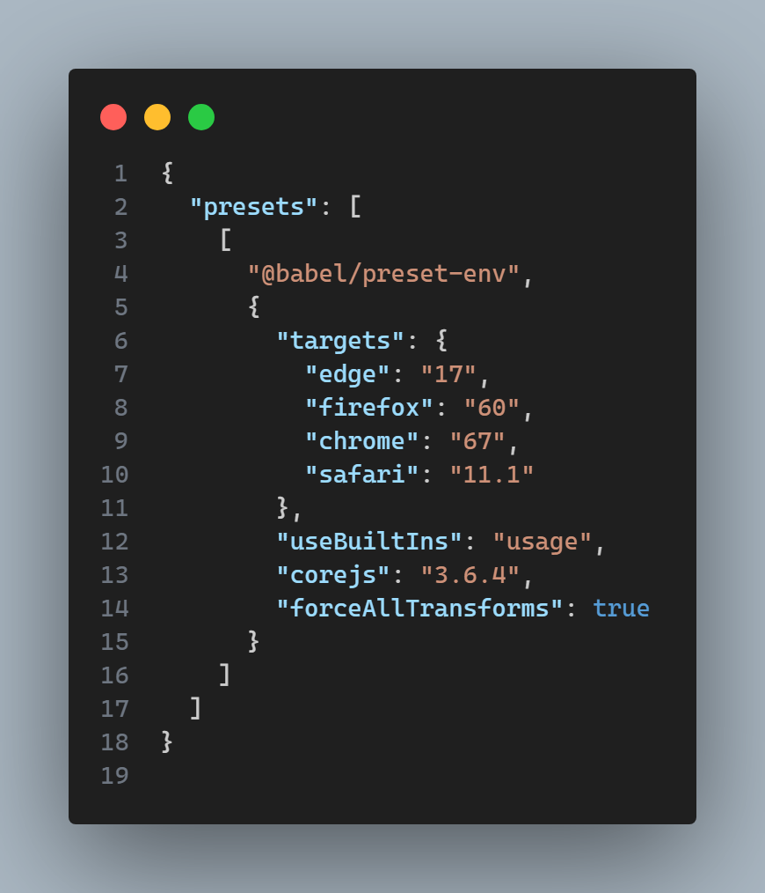

Repositorio con implementaciones de código del segundo desafío llamado "Clases en ES6", módulo 4 / Programación avanzada en JavaScript, de la beca "Desarrollo de aplicaciones Full Stack Javascript Trainee V2.0".

Los requisitos del proyecto son los siguientes:



clase Cliente es la siguiente:



Clase Impuesto es la siguiente:



Implementación del archivo main en el cual importo ambas clases e instancio objetos 
para cada caso mostrado en el diagrama UML el cual es un **cliente sin objeto impuesto** y un **cliente con objeto impuesto**:



Lo que genera en consola dicho código en main es lo siguiente:



Por último, se utiliza **Babel** con el preset **@babel/preset-env** 
para transformar código de javascript moderno a javascript compatible con navegadores antiguos, cada nuevo archivo ya sea cliente, impuesto y main se encuentran en la carpeta llamada **dist** de este repositorio.
La configuración del archivo **babel.config.json** es la siguiente:



El comando para ejecutar la generación de los nuevos archivos utilizando babel es el siguiente:

```
npx babel src/ -d dist/ --config-file ./babel.config.json
```
